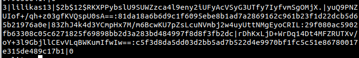

# Second SIO Project: DETI Store (ASVS Level 1)

## Index
Based on your topics, here's an updated index:

1. [Introduction](#1-introduction)
2. [Overview](#2-overview)
3. [ASVS Level 1 audit](#3-implemented-requirements)
4. [Critical Requirements](#4-critical-requirements)
   1. [(2.1.5) Verify users can change their password](#41-215-verify-users-can-change-their-password)
   2. [(2.1.6) Verify that password change functionality requires the user's current and new password](#42-216-verify-that-password-change-functionality-requires-the-users-current-and-new-password)
   3. [(2.1.8) Verify that a password strength meter is provided to help users set a stronger password](#43-218-verify-that-a-password-strength-meter-is-provided-to-help-users-set-a-stronger-password)
   4. [(2.1.12) Verify that the user can choose to either temporarily view the entire masked password, or temporarily view the last typed character of the password](#44-2112-verify-that-the-user-can-choose-to-either-temporarily-view-the-entire-masked-password-or-temporarily-view-the-last-typed-character-of-the-password-on-platforms-that-do-not-have-this-as-built-in-functionality)
   5. [(3.7.1) Verify the application ensures a valid login session or requires re-authentication or secondary verification before allowing any sensitive transactions or account modifications](#45-371-verify-the-application-ensures-a-valid-login-session-or-requires-re-authentication-or-secondary-verification-before-allowing-any-sensitive-transactions-or-account-modifications)
   6. [(4.1.5) Verify that access controls fail securely including when an exception occurs](#46-415-verify-that-access-controls-fail-securely-including-when-an-exception-occurs)
   7. [(8.3.3) Verify that users are provided clear language regarding collection and use of supplied personal information and that users have provided opt-in consent for the use of that data before it is used in any way](#47-833-verify-that-users-are-provided-clear-language-regarding-collection-and-use-of-supplied-personal-information-and-that-users-have-provided-opt-in-consent-for-the-use-of-that-data-before-it-is-used-in-any-way)
   8. [(12.1.1) Verify that the application will not accept large files that could fill up storage or cause a denial of service](#48-1211-verify-that-the-application-will-not-accept-large-files-that-could-fill-up-storage-or-cause-a-denial-of-service)
5. [Implemented Features](#5-implemented-features)
   1. [Password strength evaluation](#51-password-strength-evaluation)
       1. [(2.1.1) Verify that user set passwords are at least 12 characters in length (after multiple spaces are combined)](#511-211-verify-that-user-set-passwords-are-at-least-12-characters-in-length-after-multiple-spaces-are-combined)
       2. [(2.1.2) Verify that passwords 64 characters or longer are permitted but may be no longer than 128 characters](#512-212-verify-that-passwords-64-characters-or-longer-are-permitted-but-may-be-no-longer-than-128-characters)
       3. [(2.1.3) Verify that password truncation is not performed. However, consecutive multiple spaces may be replaced by a single space](#513-213-verify-that-password-truncation-is-not-performed-however-consecutive-multiple-spaces-may-be-replaced-by-a-single-space)
       4. [(2.1.4) Verify that any printable Unicode character, including language neutral characters such as spaces and Emojis are permitted in passwords](#514-214-verify-that-any-printable-unicode-character-including-language-neutral-characters-such-as-spaces-and-emojis-are-permitted-in-passwords)
       5. [(2.1.7) Verify that passwords submitted during account registration, login, and password change are checked against a set of breached passwords either locally (such as the top 1,000 or 10,000 most common passwords which match the system's password policy) or using an external API. If using an API a zero knowledge proof or other mechanism should be used to ensure that the plain text password is not sent or used in verifying the breach status of the password. If the password is breached, the application must require the user to set a new non-breached password](#515-217-verify-that-passwords-submitted-during-account-registration-login-and-password-change-are-checked-against-a-set-of-breached-passwords-either-locally-such-as-the-top-1000-or-10000-most-common-passwords-which-match-the-systems-password-policy-or-using-an-external-api-if-using-an-api-a-zero-knowledge-proof-or-other-mechanism-should-be-used-to-ensure-that-the-plain-text-password-is-not-sent-or-used-in-verifying-the-breach-status-of-the-password-if-the-password-is-breached-the-application-must-require-the-user-to-set-a-new-non-breached-password)
       6. [(2.1.9) Verify that there are no password composition rules limiting the type of characters permitted. There should be no requirement for upper or lower case or numbers or special characters](#516-219-verify-that-there-are-no-password-composition-rules-limiting-the-type-of-characters-permitted-there-should-be-no-requirement-for-upper-or-lower-case-or-numbers-or-special-characters)
       7. [(2.1.10) Verify that passwords are not compared to a dictionary of known bad choices (password blacklist)](#517-2110-verify-that-passwords-are-not-compared-to-a-dictionary-of-known-bad-choices-password-blacklist)
    2. [Encrypted database storage](#52-encrypted-database-storage)
        1. [(6.1.1) Verify that regulated private data is stored encrypted while at rest, such as Personally Identifiable Information (PII), sensitive personal information, or data assessed likely to be subject to EU's GDPR](#521-611-verify-that-regulated-private-data-is-stored-encrypted-while-at-rest-such-as-personally-identifiable-information-pii-sensitive-personal-information-or-data-assessed-likely-to-be-subject-to-eus-gdpr)
        2. [(6.1.2) Verify that regulated health data is stored encrypted while at rest, such as medical records, medical device details, or de-anonymized research records](#522-612-verify-that-regulated-health-data-is-stored-encrypted-while-at-rest-such-as-medical-records-medical-device-details-or-de-anonymized-research-records)
        3. [(6.1.3) Verify that regulated financial data is stored encrypted while at rest, such as financial accounts, defaults or credit history, tax records, pay history, beneficiaries, or de-anonymized market or research records](#523-613-verify-that-regulated-financial-data-is-stored-encrypted-while-at-rest-such-as-financial-accounts-defaults-or-credit-history-tax-records-pay-history-beneficiaries-or-de-anonymized-market-or-research-records)
        4. [(6.2.1) Verify that all cryptographic modules fail securely, and errors are handled in a way that does not enable Padding Oracle attacks](#524-621-verify-that-all-cryptographic-modules-fail-securely-and-errors-are-handled-in-a-way-that-does-not-enable-padding-oracle-attacks)
        5. [(6.2.2) Verify that industry proven or government approved cryptographic algorithms, modes, and libraries are used, instead of custom coded cryptography](#525-622-verify-that-industry-proven-or-government-approved-cryptographic-algorithms-modes-and-libraries-are-used-instead-of-custom-coded-cryptography)
        6. [(6.2.3) Verify that encryption initialization vector, cipher configuration, and block modes are configured securely using the latest advice](#526-623-verify-that-encryption-initialization-vector-cipher-configuration-and-block-modes-are-configured-securely-using-the-latest-advice)
        7. [(6.2.4) Verify that random number, encryption or hashing algorithms, key lengths, rounds, ciphers or modes, can be reconfigured, upgraded, or swapped at any time, to protect against cryptographic breaks](#527-624-verify-that-random-number-encryption-or-hashing-algorithms-key-lengths-rounds-ciphers-or-modes-can-be-reconfigured-upgraded-or-swapped-at-any-time-to-protect-against-cryptographic-breaks)
        8. [(6.2.5) Verify that known insecure block modes (i.e. ECB, etc.), padding modes (i.e. PKCS#1 v1.5, etc.), ciphers with small block sizes (i.e. Triple-DES, Blowfish, etc.), and weak hashing algorithms (i.e. MD5, SHA1, etc.) are not used unless required for backwards compatibility](#528-625-verify-that-known-insecure-block-modes-ie-ecb-etc-padding-modes-ie-pkcs1-v15-etc-ciphers-with-small-block-sizes-ie-triple-des-blowfish-etc-and-weak-hashing-algorithms-ie-md5-sha1-etc-are-not-used-unless-required-for-backwards-compatibility)
        9. [(6.2.6) Verify that nonces, initialization vectors, and other single use numbers must not be used more than once with a given encryption key. The method of generation must be appropriate for the algorithm being used](#529-626-verify-that-nonces-initialization-vectors-and-other-single-use-numbers-must-not-be-used-more-than-once-with-a-given-encryption-key-the-method-of-generation-must-be-appropriate-for-the-algorithm-being-used)
        10. [(6.2.7) Verify that encrypted data is authenticated via signatures, authenticated cipher modes, or HMAC to ensure that ciphertext is not altered by an unauthorized party](#5210-627-verify-that-encrypted-data-is-authenticated-via-signatures-authenticated-cipher-modes-or-hmac-to-ensure-that-ciphertext-is-not-altered-by-an-unauthorized-party)
        11. [(6.2.8) Verify that all cryptographic operations are constant-time, with no 'short-circuit' operations in comparisons, calculations, or returns, to avoid leaking information](#5211-628-verify-that-all-cryptographic-operations-are-constant-time-with-no-short-circuit-operations-in-comparisons-calculations-or-returns-to-avoid-leaking-information)
        12. [(8.3.1) Verify that sensitive data is sent to the server in the HTTP message body or headers, and that query string parameters from any HTTP verb do not contain sensitive data](#5212-831-verify-that-sensitive-data-is-sent-to-the-server-in-the-http-message-body-or-headers-and-that-query-string-parameters-from-any-http-verb-do-not-contain-sensitive-data)
        13. [(8.3.2) Verify that users have a method to remove or export their data on demand](#5213-832-verify-that-users-have-a-method-to-remove-or-export-their-data-on-demand)
        14. [(8.3.3) Verify that users are provided clear language regarding collection and use of supplied personal information and that users have provided opt-in consent for the use of that data before it is used in any way](#5214-833-verify-that-users-are-provided-clear-language-regarding-collection-and-use-of-supplied-personal-information-and-that-users-have-provided-opt-in-consent-for-the-use-of-that-data-before-it-is-used-in-any-way)
        15. [(8.3.4) Verify that all sensitive data created and processed by the application has been identified, and ensure that a policy is in place on how to deal with sensitive data](#5215-834-verify-that-all-sensitive-data-created-and-processed-by-the-application-has-been-identified-and-ensure-that-a-policy-is-in-place-on-how-to-deal-with-sensitive-data)
        16. [(8.3.5) Verify accessing sensitive data is audited (without logging the sensitive data itself), if the data is collected under relevant data protection directives or where logging of access is required](#5216-835-verify-accessing-sensitive-data-is-audited-without-logging-the-sensitive-data-itself-if-the-data-is-collected-under-relevant-data-protection-directives-or-where-logging-of-access-is-required)
        17. [(8.3.6) Verify that sensitive information contained in memory is overwritten as soon as it is no longer required to mitigate memory dumping attacks, using zeroes or random data](#5217-836-verify-that-sensitive-information-contained-in-memory-is-overwritten-as-soon-as-it-is-no-longer-required-to-mitigate-memory-dumping-attacks-using-zeroes-or-random-data)
        18. [(8.3.7) Verify that sensitive or private information that is required to be encrypted, is encrypted using approved algorithms that provide both confidentiality and integrity](#5218-837-verify-that-sensitive-or-private-information-that-is-required-to-be-encrypted-is-encrypted-using-approved-algorithms-that-provide-both-confidentiality-and-integrity)
        19. [(8.3.8) Verify that sensitive personal information is subject to data retention classification, such that old or out of date data is deleted automatically, on a schedule, or as the situation requires](#5219-838-verify-that-sensitive-personal-information-is-subject-to-data-retention-classification-such-that-old-or-out-of-date-data-is-deleted-automatically-on-a-schedule-or-as-the-situation-requires)
6. [Final considerations](#6-final-considerations)
7. [References](#7-references)

## 1. Introduction

This is the second project for the Curricular Unit SIO. The objective of this project is to use the application developed in the first project as a foundation and conduct a security analysis of it, based on ASVS Level 1. Subsequently, the task is to resolve the eight most critical vulnerabilities found and concurrently choose 2 software features to implement.

## 2. Overview

In this assignment we decided to work with Flask, using a SQLAlchemy database for persistence of the data and Jinja2 for rendering data in the templates. For the fronted we utilized pure HTML and CSS.

The tool used for the audit was the Excel provided by the professor, OWASP ASVS checklist for audits, which provides a list of verification requirements alongside fields to demonstrate the source code, the tools used and to leave comments about the issues.

For the implementation of the features we chose to implement Password strength evaluation and Encrypted database storage.

### ASVS Level 1 audit

Using the original application as a basis, we conducted an audit using the ASVS Level 1 checklist. For each requirement listed in the checklist, we marked it as Valid, Non-valid, or Not Applicable, depending on what made sense in the context of our application. We then wrote a brief comment to justify our choice. In some cases, we also identified the source code that validated the audit, as well as the tools used for this purpose. 

The audit results indicated that 44% of ASVS Level 1 requirements were met. More details can be found in the `audit.xlsx` file located in the analysis folder.

## 3. Implemented Requirements

| #     | CWE | Requirement                                                                   | Criticality                                                                                                           | Fix                                                                                                                         |
|-------|-----|-------------------------------------------------------------------------------|-----------------------------------------------------------------------------------------------------------------------|-----------------------------------------------------------------------------------------------------------------------------|
| 2.1.5 | 620 | Verify users can change their password.                                       | Enabling users to change passwords is crucial for security and user experience. It allows for regular security updates, facilitates password recovery, and ensures adaptability to policies. It's essential for preventing unauthorized access, complying with security standards, etc. Overall, it empowers users, enhances privacy, and aligns with best practices in user account management. | Create a self-service password reset feature.                                                                               |
| 2.1.6 | 620 | Verify that password change functionality requires the user's current and new password. | Requiring both the current and new password for a password change adds an essential layer of security. It ensures that only authorized users with knowledge of the current password can modify account credentials. This practice prevents unauthorized changes and reinforces the authenticity of password updates, contributing to a robust and reliable user authentication system. | Implement a field for the user to confirm the current password alongside the one to create a new one. If the inserted password matches the current password stored in the database, the request to change the password is successful. |
| 2.1.8 | 521 | Verify that a password strength meter is provided to help users set a stronger password. | Implementing a password strength meter is crucial to enhance user experience and bolster security decisions. This tool provides real-time feedback, guiding users to create robust passwords, fortifying systems against potential breaches. It promotes personal security awareness, encouraging active participation in digital safety. By complying with industry best practices, organizations demonstrate a commitment to cybersecurity, mitigating the risk of unauthorized access. | Implement a password strength meter on the user's registration page.                                                         |
| 2.1.12| 521 | Verify that the user can choose to either temporarily view the entire masked password, or temporarily view the last typed character of the password on platforms that do not have this as built-in functionality. | Enhancing user flexibility by allowing temporary password visibility improves user experience and accessibility, accommodating different preferences and needs on platforms lacking built-in features. | Implement a "Show" button that allows users to check their password.                                                           |
| 3.7.1 | 778 | Verify the application ensures a valid login session or requires re-authentication or secondary verification before allowing any sensitive transactions or account modifications. | Ensuring a valid login session or requiring re-authentication for sensitive transactions is paramount for any e-commerce web app. This practice safeguards customer accounts, preventing unauthorized access to sensitive functions. By implementing this security measure, we fortify our platform against fraudulent activities and protect financial transactions. | When in the checkout page, when the user has to fill in the payment method fields, the password must be given again in order to confirm the purchase.                                            |
| 4.1.5 | 285 | Verify that access controls fail securely including when an exception occurs.   | Verifying secure access control failure ensures that unexpected errors don't compromise security, protecting sensitive information, thwarting exploitation attempts, and maintaining user trust. It aligns with standards, proactively addresses vulnerabilities, and fulfills legal requirements. | Create multiple error handling functions that show costumized pages/messages when certain errors occur                                                                                                         |
| 8.3.3 | 285 | Verify that users are provided clear language regarding the collection and use of supplied personal information and that users have provided opt-in consent for the use of that data before it is used in any way. | Obtaining clear language and opt-in consent for the use of personal data is crucial. It respects user privacy, builds trust, and aligns with data protection standards like GDPR. Non-compliance can lead to penalties and damage to reputation, making it vital to address this issue proactively.                                                                                                     | Added a checkbox to the register page that the users need to check in order to create a new account.                     |
| 12.1.1| 400 | Verify that the application will not accept large files that could fill up storage or cause a denial of service. | A potential vulnerability in our web application lies in the upload functionality, particularly in product reviews where there is currently no validation for the size of uploaded files. This presents an avenue for attackers to exploit by uploading large files, posing a security risk that needs immediate attention. | Implement robust file size verification and validation processes prior to allowing any uploads on our web application. This preventive measure ensures that only files within acceptable size limits are permitted, enhancing security and mitigating the risk of potential exploits. |

## 4. Critical Requirements

## 4.1 (2.1.5) Verify users can change their password

The ability for users to change their password is a critical feature in any system that requires user authentication. This feature is a fundamental part of secure account management and user privacy.

If users are unable to change their passwords, it can lead to several security issues. For instance, if a user's password is compromised, they would be unable to change it to prevent unauthorized access. This could lead to unauthorized individuals gaining access to sensitive information, performing actions as the user, or even locking the user out of their own account.

Furthermore, the inability to change passwords prevents users from updating their passwords regularly. Which is a good security practice. Additionally, users may need to change their password for personal reasons, such as forgetting their current password.

Therefore, not having the ability for users to change their passwords can significantly increase the risk of account breaches, compromise user privacy, and potentially lead to loss of user trust in the system. It is crucial for any system to allow users to change their passwords to maintain secure and private user accounts.

### Solution:

To resolve this issue, we implemented a new page where the user can change their personal information, such as their password. This page is only accessible to authenticated users.

```python
class UpdatePassword(FlaskForm):
    new_password = PasswordField('new_password', validators=[InputRequired(), Length(min=12, max=128)], render_kw={"placeholder": "New Password"})
    submit = SubmitField('Update')
    # .... validation ....


@app.route('/change_password', methods=['GET', 'POST'])
@login_required
def change_password():
    form = UpdatePassword()
    if form.validate_on_submit():
        user = User.query.filter_by(username = current_user.username).first()
        hashed_password = bcrypt.generate_password_hash(form.new_password.data)
        current_user.password = hashed_password
        db.session.commit()
        flash('Your pass has been updated!', 'success')
        return redirect(url_for('account'))
    return render_template('change_password.html', form = form)
```


| Before | After |
| ------ | ----- |
|  |  |

## 4.2 (2.1.6) Verify that password change functionality requires the user's current and new password

In the context of user account security, it's essential that the process of changing a password involves a step where the current password is verified before a new one is set. This acts as a safeguard, confirming the identity of the user initiating the password change.

If this step is missing, it creates a vulnerability that could be exploited by malicious actors. For instance, if a user's session is left open or hijacked, the attacker could change the password without needing to know the current one. This would effectively lock the original user out of their account and give the attacker unrestricted access.

This vulnerability could also lead to a false sense of security for users. If a user realizes they've left their session open and decides to change their password, they might not be aware that an attacker has already changed it. This would allow the attacker to maintain access to the account, even after the user believes they've secured it.

In summary, not verifying the current password during a password change can lead to unauthorized account access and potential data breaches. It's therefore of utmost importance to enforce this requirement to uphold the integrity and security of user accounts.

### Solution:

To solve this issue, we implemented a field for the user to confirm the current password alongside the one to create a new one. If the inserted password matches the current password stored in the database, the request to change the password is successful.

```python
@app.route('/change_password', methods=['GET', 'POST'])
@login_required
def change_password():
    form = UpdatePassword()
    if form.validate_on_submit():
        user = User.query.filter_by(username = current_user.username).first()
        if user and bcrypt.check_password_hash(user.password, form.password.data):
            hashed_password = bcrypt.generate_password_hash(form.new_password.data)
            current_user.password = hashed_password
            db.session.commit()
            flash('Your pass has been updated!', 'success')
            return redirect(url_for('account'))
        else:
            session.pop('_flashes', None)  # clear all flash messages
            print('Invalid password')
            flash('Invalid password')
    return render_template('change_password.html', form = form)
```


## 4.3 (2.1.8) Verify that a password strength meter is provided to help users set a stronger password

A password strength meter is a tool that provides real-time feedback on the strength of a password as a user types it. It encourages users to create stronger, more secure passwords, which are harder for attackers to guess or crack.

If a system does not provide a password strength meter, users may unknowingly create weak passwords. Weak passwords are easier for attackers to guess or crack using techniques like brute force attacks, dictionary attacks, or simple guessing. This can lead to unauthorized access to the user's account, potentially resulting in data breaches or other security incidents.

Without a password strength meter, users may not be aware of what constitutes a strong password. They may not know to include a mix of uppercase and lowercase letters, numbers, and special characters, or to avoid common words and phrases.

### Solution:

```python
from zxcvbn import zxcvbn

password_strength = zxcvbn(passw_without_spaces)

if password_strength['score'] < 3:
            raise ValidationError(f'This password is not strong enough. {password_strength["feedback"]["suggestions"]}')
        
```

```js and html
document.addEventListener("DOMContentLoaded", function () {
        var passwordField = document.querySelector('[name="password"]');
        passwordField.addEventListener("input", checkPasswordStrength);
    });

    function checkPasswordStrength() {
        var password = document.querySelector('[name="password"]').value;
        var passwordStrengthText = document.getElementById("password-strength-text");
        var passwordStrengthMeter = document.getElementById("password-strength-meter");

        if (typeof zxcvbn === "function") {
            console.log("zxcvbn library is available");
        } else {
            console.error("zxcvbn library not found");
            return;
        }

        var passwordStrength = zxcvbn(password);
        var zxcvbnScore = passwordStrength.score;
        switch (zxcvbnScore) {
            case 0:
                passwordStrengthText.textContent = "Password strength: Very Weak";
                passwordStrengthText.style.color = "red";
                passwordStrengthMeter.value = 1;
                break;
            case 1:
                passwordStrengthText.textContent = "Password strength: Weak";
                passwordStrengthText.style.color = "orange";
                passwordStrengthMeter.value = 2;
                break;
            case 2:
                passwordStrengthText.textContent = "Password strength: Moderate";
                passwordStrengthText.style.color = "yellow";
                passwordStrengthMeter.value = 3;
                break;
            case 3:
                passwordStrengthText.textContent = "Password strength: Strong";
                passwordStrengthText.style.color = "green";
                passwordStrengthMeter.value = 4;
                break;
            case 4:
                passwordStrengthText.textContent = "Password strength: Very Strong";
                passwordStrengthText.style.color = "darkgreen";
                passwordStrengthMeter.value = 5;
                break;
            default:
                break;
        }
    }
```

We used the zxcvbn library which is a password strength estimation library in Python. It evaluates the strength of a password based on factors such as length, complexity, and common patterns. The library provides a score (from 0 to 4) indicating the password's strength, where 0 is weak and 4 is strong. It also offers suggestions for improving password strength. The primary goal is to help users create more secure passwords.

In our RegisterForm Class we used it to prevent users from creating a weak password, offering feedback and suggestions.


We've also used the zxcvbn library to create a visual reference in the register page itself, where it shows a progress bar and text varying from "Weak" to "Very Strong" in order to facilitate the user's experience in creating a strong password.


## 4.4. (2.1.12) Verify that the user can choose to either temporarily view the entire masked password, or temporarily view the last typed character of the password on platforms that do not have this as built-in functionality

This requirement pertains to the visibility of passwords during the input process. In this app we mask passwords as they are typed, with dots, to prevent others from seeing the password. However, this can sometimes lead to user errors when typing their password, especially if it's complex or lengthy.

If a platform doesn't provide built-in functionality to temporarily view the entire masked password or the last typed character, it can lead to increased user frustration and potential errors. Users might enter their password incorrectly without realizing it, leading to failed login attempts.

### Solution:

To solve this issue, we implemented a "Show" button that allows users to check their password in all the password fields of the application.

```js and html
<button type="button" onclick="togglePasswordVisibility()">Show</button>

function togglePasswordVisibility() {
        var passwordField = document.querySelector('[name="password"]');
        if (passwordField.type === "password") {
            passwordField.type = "text";
        } else {
            passwordField.type = "password";
        }
    }
```


## 4.5 (3.7.1) Verify the application ensures a valid login session or requires re-authentication or secondary verification before allowing any sensitive transactions or account modifications

An application needs to verify the authenticity of a user session or require re-authentication or secondary verification before permitting any sensitive transactions or modifications to account settings. This is a vital security measure to thwart unauthorized actions on a user's account.

If an application does not enforce this requirement, it can lead to serious security issues. For instance, if an attacker manages to hijack a user's session, they could perform sensitive transactions or modify the account settings without any additional verification. This could lead to unauthorized transactions, changes to the user's personal information, or even account takeover.

Moreover, without this requirement, a user who leaves their session open on a public computer is at risk. Anyone who uses the computer afterwards could perform sensitive actions on the user's account without needing to re-authenticate.

Therefore, not enforcing this requirement can lead to unauthorized actions on user accounts, potentially resulting in financial loss, privacy violations, or account takeover. It's a significant issue in terms of user account security.

### Solution:

To solve this problem, we added a password field to the checkout page. This way, when the user is about to make a purchase, they need to confirm their password before the order is placed and payment is processed.

```python
class CheckoutForm(FlaskForm):
    password = PasswordField('Password', validators=[InputRequired(), Length(min=12, max=128)], render_kw={"placeholder": "Password"})
    # ...other fields...

@app.route('/checkout', methods=['GET', 'POST'])
@login_required
def checkout():
    form = CheckoutForm()
    if form.validate_on_submit():
        if not bcrypt.check_password_hash(current_user.password, form.password.data):
            flash("Invalid password", "danger")
            return redirect(url_for('checkout'))
        # ...order creation...
```

## 4.6 (4.1.5) Verify that access controls fail securely including when an exception occurs

The access control mechanisms of an application need to be designed to fail securely, even when an exception occurs. This implies that if an error or unexpected condition arises, the system should default to a state of denying access, rather than inadvertently granting it.

If an application does not adhere to this principle, it can lead to serious security vulnerabilities. For instance, if an exception occurs during the access control check and the system defaults to granting access, an unauthorized user could gain access to sensitive resources or functionality.

Attackers could intentionally trigger exceptions as a strategy to bypass access controls. If the system fails open in response to exceptions, this could be a viable attack vector.

### Problematic source code:

Our application didn't handle errors and exceptions in any way so there isn't any snippet that we can show as "problematic source code".

This presents a problem in our webapp security since when an exception occurs during the execution of a web application, Flask will typically return a generic error message to the user, revealing potentially sensitive information about the application's internal structure. This lack of custom error handling can make it easier for attackers to exploit vulnerabilities or gain insights into the system.

### Solution:

```python
@app.errorhandler(404)
def page_not_found(e):
	logging.error(f"Page not found: {e}")
	return render_template('404.html'), 404

@app.errorhandler(403)
def forbidden(e):
	logging.error(f"Forbidden: {e}")
	return render_template('403.html'), 403

@app.errorhandler(500)
def internal_server_error(e):
    logging.error(f"Internal Server Error: {e}")
    return render_template('500.html'), 500

@app.errorhandler(400)
def bad_request(e):
    logging.error(f"Bad Request: {e}")
    return render_template('400.html'), 400
```

This collection of error handling functions significantly mitigates the risk of attacks. By offering clear yet restricted feedback through specific HTTP status codes and personalized error pages, it minimizes the exposure of sensitive information, making it harder for attackers to exploit vulnerabilities. Furthermore, the incorporation of logging statements equips developers with essential insights, enabling them to proactively address security vulnerabilities and enhance the overall robustness of the system.

## 4.7 (8.3.3) Verify that users are provided clear language regarding collection and use of supplied personal information and that users have provided opt-in consent for the use of that data before it is used in any way

The necessity here is to ensure transparency and consent when collecting and using personal information. It's important that users are clearly informed about the usage of their data, and they should provide active consent prior to any data processing.

If an application does not meet this requirement, it can lead to a number of issues. First, it can result in a violation of privacy laws and regulations, such as the General Data Protection Regulation (GDPR) in the European Union, which could lead to legal penalties.

Second, it can lead to a loss of trust among users. If users discover that their data is being used in ways they did not consent to, they may stop using the application and discourage others from using it as well.

Finally, it can lead to ethical issues. Using someone's personal data without their informed consent is generally considered unethical.

### Solution:

A solution to this is asking the user for permission to use their data when they register. This is done by adding a checkbox to the register page that the users need to check in order to create a new account.

```python
class RegisterForm(FlaskForm):
    consent = BooleanField('I agree to the collection and use of my data.', validators=[InputRequired()])
    # ...other fields...
```

## 4.8. (12.1.1) Verify that the application will not accept large files that could fill up storage or cause a denial of service

The application needs to have safeguards in place to prevent the upload of excessively large files that could consume all available storage or overwhelm system resources, leading to a denial of service (DoS).

If an application does not have these safeguards, it can be vulnerable to DoS attacks. An attacker could intentionally upload very large files to consume all available storage or overwhelm system resources, causing the application to become slow or unresponsive for other users. This could disrupt the application's functionality and availability, leading to a poor user experience and potential loss of business.

If the storage is filled up, it could also disrupt other processes that require storage, such as logging or data processing tasks. This could lead to loss of data or functionality.

### Problematic source code:

#### app.py:

```python
@app.route('/add_review', methods=['POST'])
@login_required
def add_review():
    product_id = request.form.get('product_id')
    rating = request.form.get('rating')
    comment = request.form.get('comment')
    
    review = Review(product_id=product_id, rating=rating, comment=comment)
    db.session.add(review)
    db.session.commit()

    return redirect(url_for('product', product_id=product_id))
```

#### product.html:

```html
<input type="file" name="file" id="file" accept=".jpg, .png, .gif">
```

The absence of file size verification, both in the backend and frontend, poses a significant vulnerability. This oversight enables malicious actors to upload excessively large files without detection. This loophole can have profound implications, potentially leading to system instability, resource exhaustion, and a heightened risk of various cyber threats.

### Solution:

```python
@app.route('/add_review', methods=['POST'])
@login_required
def add_review():
    try:
        product_id = request.form.get('product_id')
        rating = request.form.get('rating')
        comment = request.form.get('comment')
                                   
        file = request.files.get('file')
        if file and allowed_file(file.filename):
            if file.content_length < app.config['MAX_CONTENT_LENGTH']:
                # Process the file (save to disk, perform actions, etc.)
                filename = secure_filename(file.filename)
                file.save(os.path.join(app.config['UPLOAD_FOLDER'], filename))

        elif file and not allowed_file(file.filename):
            flash('Invalid file type. Allowed types are jpg, png, and gif.', 'error')

        review = Review(product_id=product_id, rating=rating, comment=comment)
        db.session.add(review)
        db.session.commit()

        return redirect(url_for('product', product_id=product_id))
    except Exception as e:
        print(f"Exception: {e}")
        raise
 
   
@app.errorhandler(RequestEntityTooLarge)
def handle_file_too_large(e):
    flash('The data value transmitted exceeds the capacity limit (2 MB).', 'error')
    product_id = session.get('last_product_id') 
    if product_id:
        return redirect(url_for('product', product_id=product_id))
    else:
        return redirect(url_for('catalog'))

def allowed_file(filename):
    return '.' in filename and filename.rsplit('.', 1)[1].lower() in {'jpg', 'png', 'gif'}

```

To comply with this requirement, our solution ensures secure file uploads on the website. It checks if the uploaded file is allowed and its size is within the configured limit. If valid, the file is saved to the server, and a new review with associated details is added to the database. If the file type is invalid, an error message is displayed. In case of a file size exceeding the limit, a custom error handler flashes a corresponding message. The solution handles exceptions, redirects users based on the product context, and maintains a whitelist of permitted file extensions.

## 5. Implemented Features

## 5.1 Password strength evaluation

The Password Strength Evaluation feature in our system is in accordance with V2.1 guidelines from the ASVS requirements. This feature mandates a minimum strength for passwords, ensuring that user credentials meet robust security standards. Furthermore, the implementation incorporates breach verification through an external service, bolstering our defense mechanisms by cross-referencing passwords against known breaches.

This proactive approach not only fortifies the integrity of user accounts but also aligns our system with the latest security protocols, fostering a resilient and safeguarded authentication environment.

The requirements for this feature are:

## 5.1.1. (2.1.1) Verify that user set passwords are at least 12 characters in length (after multiple spaces are combined)

### Implementation:

In the validate_password function of the RegisterForm Class, we've added the following:

```python
if len(passw_without_spaces) < 12:
    raise ValidationError('Password must be at least 12 characters long.')
        
```

## 5.1.2. (2.1.2) Verify that passwords 64 characters or longer are permitted but may be no longer than 128 characters

### Implementation:

In the validate_password function of the RegisterForm Class, we've added the following:

```python
if len(passw_without_spaces) > 128:
    raise ValidationError('Password must be no longer than 128 characters.')
        
```

## 5.1.3. (2.1.3) Verify that password truncation is not performed. However, consecutive multiple spaces may be replaced by a single space

### Implementation:

In the validate_password function of the RegisterForm Class, we've added the following, to replace consecutive multiple spaces with a single space:

```python
passw = password.data
passw_without_spaces = re.sub(' +', ' ', passw) 
```

Here the user inputs a password with consecutive multiple spaces, which are replaced by a single space and allowed:


## 5.1.4. (2.1.4) Verify that any printable Unicode character, including language neutral characters such as spaces and Emojis are permitted in passwords

### Implementation:

In the validate_password function of the RegisterForm Class, we've added the following:

```python
pattern = re.compile(r'^[\u0020-\uD7FF\uE000-\uFFFD\u10000-\u10FFF]*$') # Match any printable Unicode character, including language neutral characters such as spaces and Emojis
if not pattern.match(passw_without_spaces):
    raise ValidationError('Password must only contain printable Unicode characters.')
```

## 5.1.5. (2.1.7) Verify that passwords submitted during account registration, login, and password change are checked against a set of breached passwords either locally (such as the top 1,000 or 10,000 most common passwords which match the system's password policy) or using an external API. If using an API a zero knowledge proof or other mechanism should be used to ensure that the plain text password is not sent or used in verifying the breach status of the password. If the password is breached, the application must require the user to set a new non-breached password

### Implementation:

The Have I Been Pwned (HIBP) API is a service that allows users to check if their passwords or email addresses have been compromised in data breaches. The API provides access to a database of breached credentials. Users can send a hash of their password or email address to the API, and it will respond with information on whether the data has appeared in known breaches. The API helps individuals and organizations assess the security of their credentials and take necessary steps to enhance their online security.

We have implemented the HIBP API in order to check whether the password the user is trying to register with has been breached.
We have added the is_password_pwned function in the RegisterForm Class, and then checked if the password has been compromised on the validate_password function:

```python
def is_password_pwned(self, password):
    password = hashlib.sha1(password.encode('utf-8')).hexdigest().upper()
    prefix, suffix = password[:5], password[5:]

    # Make a request to the HIBP Pwned Passwords API
    url = f'https://api.pwnedpasswords.com/range/{prefix}'
    response = requests.get(url)

    if response.status_code == 200:
        # Check if the password suffix exists in the response
        return suffix in response.text
    else:
        # Handle other status codes, you may choose to log an error or raise an exception
        return False

def validate_password(self, password):
    # (...)
    if self.is_password_pwned(passw_without_spaces):
        raise ValidationError('This password has been compromised. Choose a different one.')

```

Here the user attempts to create a password that has been compromised:


## 5.1.6. (2.1.9) Verify that there are no password composition rules limiting the type of characters permitted. There should be no requirement for upper or lower case or numbers or special characters

### Implementation:

We have removed checks in the validate_password function of the RegisterForm Class that limited the type of characteers permitted and checked also for lower and upper cases, numbers and special characters that existed in the original app.

## 5.1.7. (2.1.10) Verify that passwords are not compared to a dictionary of known bad choices (password blacklist)

### Implementation:

The password validation does not rely on a password blacklist.

## 5.2 Encrypted database storage

The Encrypted Database Storage feature, follows the verification requirements from security standards V6.1, V6.2, and V8.3 from the ASVS checklist. This feature mandates the encryption of critical data within the Web application, ensuring that sensitive information remains safeguarded against unauthorized access. By adhering to this security measure, we fortify our system's resilience against potential breaches, mitigating risks associated with data exposure. This proactive approach not only enhances the confidentiality of stored data but also underscores our commitment to implementing robust encryption practices for a secure and protected user environment.

It's important to mention that to implement the requeriments from the ASVS checklist V6.2, a "detishop_cryptography.py" file was created.

The requirements for this feature are:

## 5.2.1. (6.1.1) Verify that regulated private data is stored encrypted while at rest, such as Personally Identifiable Information (PII), sensitive personal information, or data assessed likely to be subject to EU's GDPR

Storing regulated private data like PII without encryption at rest violates security standards and regulations such as GDPR. This poses a significant risk of unauthorized access and data breaches, compromising individuals' sensitive information. To mitigate this risk we encrypt all sensitive data before storing it in the database. The encryption process is explained further in [5.2.5: Verify Cryptographic Implementation](#525-622-verify-that-industry-proven-or-government-approved-cryptographic-algorithms-modes-and-libraries-are-used-instead-of-custom-coded-cryptography).

### Implementation:

```python
@app.route('/checkout', methods=['GET', 'POST'])
@login_required
def checkout():
    form = CheckoutForm()
    if form.validate_on_submit():
        if not bcrypt.check_password_hash(current_user.password, form.password.data):
            flash("Invalid password", "danger")
            return redirect(url_for('checkout'))
        user = User.query.filter_by(username = current_user.username).first()
        ref = str(random.randint(10000, 99999))
        products, grand_total, quantity_total = handle_cart()
        if user:
            encrypted_first_name = encrypt_with_hmac(key, form.first_name.data, hash_key)
            encrypted_last_name = encrypt_with_hmac(key, form.last_name.data, hash_key)
            encrypted_phone_number = encrypt_with_hmac(key, form.phone_number.data, hash_key)
            encrypted_email = encrypt_with_hmac(key, form.email.data, hash_key)
            encrypted_address = encrypt_with_hmac(key, form.address.data, hash_key)
            encrypted_city = encrypt_with_hmac(key, form.city.data, hash_key)
            encrypted_country = encrypt_with_hmac(key, form.country.data, hash_key)

            order = Order(
                id_user=user.id,
                reference=ref,
                first_name=encrypted_first_name,
                last_name=encrypted_last_name,
                phone_number=encrypted_phone_number,
                email=encrypted_email,
                address=encrypted_address,
                city=encrypted_city,
                country=encrypted_country,
                status="New",  # or whatever default status
            )
    # ...rest of the code...
```

## 5.2.2. (6.1.2) Verify that regulated health data is stored encrypted while at rest, such as medical records, medical device details, or de-anonymized research records.

This feature is non-applicable to our web app, since we don't deal with any health data.

## 5.2.3. (6.1.3) Verify that regulated financial data is stored encrypted while at rest, such as financial accounts, defaults or credit history, tax records, pay history, beneficiaries, or de-anonymized market or research records

Not encrypting financial data may lead to financial fraud, identity theft and other malicious activity. To deal with this risk, we encrypt all financial data before storing it in the database.

### Implementation:

```python
# Checkout section
        if form.payment_method.data == 'Credit Card':
            order.card_number = encrypt_with_hmac(key, form.card_number.data, hash_key)
            order.expiration_date = encrypt_with_hmac(key, form.expiration_date.data, hash_key)
            order.cvv = encrypt_with_hmac(key, form.cvv.data, hash_key)
        elif form.payment_method.data == 'Paypal':
            order.paypal_email = encrypt_with_hmac(key, form.paypal_email.data, hash_key)
        elif form.payment_method.data == 'MBWay':
            order.mbway_phone_number = encrypt_with_hmac(key, form.mbway_phone_number.data, hash_key)
# ...rest of the code...
```

## 5.2.4. (6.2.1) Verify that all cryptographic modules fail securely, and errors are handled in a way that does not enable Padding Oracle attacks

### Implementation:

To check this requirement, all the functions from the file "detishop_cryptography" (except for the generate_key function) have a try...except method. If a an exception occurs, the operation that failed is stored in the "app.log" file so that it can be analyzed only by the development team. No sensitive message is sent to the user of the website, making it hard for attackers to find possible vulnerabilities through error messages.

#### Examples:

```python
 except Exception as e:
        logging.error(f"Encryption error: {e}")
        logging.exception("An exception occurred during encryption:")
        raise
```

```python
 except Exception as e:
        logging.error(f"Decryption error: {e}")
        logging.exception("An exception occurred during decryption:")
        raise
```

## 5.2.5. (6.2.2) Verify that industry proven or government approved cryptographic algorithms, modes, and libraries are used, instead of custom coded cryptography

### Implementation:
Within the "detishop_cryptography" file, our approach to encryption and decryption is grounded in the AES cryptographic algorithm paired with the CFB mode. Complementing this, we leverage the Python Bcrypt library for secure password hashing. AES is renowned for its established security standards, and CFB mode offers a streamlined and robust approach, ensuring effective encryption across varying data sizes. Besides that, Bcrypt's adaptive hashing algorithm not only provides a strong defense against brute-force attacks but also introduces a crucial layer of protection, reinforcing the safeguarding of sensitive information.

#### Examples:
```python
def encrypt(key, plaintext):
    try:
        iv = os.urandom(16)
        cipher = Cipher(algorithms.AES(key), modes.CFB(iv), backend=default_backend())
        encryptor = cipher.encryptor()
        ciphertext = encryptor.update(plaintext.encode('utf-8')) + encryptor.finalize()
        return b64encode(iv + ciphertext).decode('utf-8')
    except Exception as e:
        logging.error(f"Encryption error: {e}")
        logging.exception("An exception occurred during encryption:")
        raise
```

## 5.2.6. (6.2.3) Verify that encryption initialization vector, cipher configuration, and block modes are configured securely using the latest advice

### Implementation:
The Initialization Vector (IV) is generated securely using a random number generator, and its uniqueness is guaranteed for each encryption operation, preventing patterns that might compromise security. The AES cipher configuration employs the CFB mode, a choice consistent with contemporary cryptographic standards. Additionally, the code relies on the default_backend() function, dynamically selecting the default cryptographic backend. This ensures that the underlying cryptographic engine adheres to the latest security recommendations and benefits from any platform-specific optimizations.

#### Examples

```python
def encrypt(key, plaintext):
    try:
        iv = os.urandom(16)
        cipher = Cipher(algorithms.AES(key), modes.CFB(iv), backend=default_backend())
```

```python
def decrypt(key, ciphertext):
    try:
        ciphertext = b64decode(ciphertext)
        iv = ciphertext[:16]
        ciphertext = ciphertext[16:]

        cipher = Cipher(algorithms.AES(key), modes.CFB(iv), backend=default_backend())
```

## 5.2.7. (6.2.4) Verify that random number, encryption or hashing algorithms, key lengths, rounds, ciphers or modes, can be reconfigured, upgraded, or swapped at any time, to protect against cryptographic breaks

### Implementation:

The implementation showcases a high degree of adaptability in encryption-related configurations. For instance, the generate_key() function facilitates dynamic changes in key lengths through the use of os.urandom(32), allowing seamless adjustments to varying security requirements.
Moreover, the code has a design that facilitates algorithm swapping, particularly in the realm of encryption and decryption methods. The choice of the AES encryption algorithm is structured in a manner that accommodates easy modifications, enabling the integration of alternative algorithms without disrupting the overall functionality.
Additionally, the HMAC implementation within encrypt_with_hmac and decrypt_with_hmac is configured with dynamic adaptability.

#### Example:

```python
def encrypt(key, plaintext):
    try:
        iv = os.urandom(16)
        cipher = Cipher(algorithms.AES(key), modes.CFB(iv), backend=default_backend())
        encryptor = cipher.encryptor()
        ciphertext = encryptor.update(plaintext.encode('utf-8')) + encryptor.finalize()
        return b64encode(iv + ciphertext).decode('utf-8')
    except Exception as e:
        logging.error(f"Encryption error: {e}")
        logging.exception("An exception occurred during encryption:")
        raise
```

As we can check, in the "iv" variable we can easily change the key lenght, just by swapping the parameter of the function os.urandom, and we can easily change the algorithms and modes, just by changing the their types.

## 5.2.8. (6.2.5) Verify that known insecure block modes (i.e. ECB, etc.), padding modes (i.e. PKCS#1 v1.5, etc.), ciphers with small block sizes (i.e. Triple-DES, Blowfish, etc.), and weak hashing algorithms (i.e. MD5, SHA1, etc.) are not used unless required for backwards compatibility

### Implementation:
In terms of secure block modes and padding, the code deliberately selects the CFB block mode for both encryption and decryption processes. This deliberate choice serves to mitigate vulnerabilities commonly associated with insecure block modes like ECB and potentially risky padding modes like PKCS#1 v1.5.
Furthermore, the code uses an adequate block size and cipher. By opting for the AES encryption algorithm, which employs a robustly sized block, the code steers clear of potentially insecure ciphers with smaller block sizes, such as Triple-DES and Blowfish.
Additionally, the code prioritizes a strong hashing algorithm by embracing SHA-256 for HMAC implementation. This strategic choice ensures resilience against vulnerabilities linked to weaker hashing algorithms, including the commonly deprecated MD5 and SHA-1.

## 5.2.9. (6.2.6) Verify that nonces, initialization vectors, and other single use numbers must not be used more than once with a given encryption key. The method of generation must be appropriate for the algorithm being used

### Implementation:

In the code, the IV's (Inicialization Vectors) are generated in each encryption, assuring that they are never used more than once with a given encryption key.

#### Examples:
```python
def encrypt(key, plaintext):
    try:
        iv = os.urandom(16)
```

## 5.2.10. (6.2.7) Verify that encrypted data is authenticated via signatures, authenticated cipher modes, or HMAC to ensure that ciphertext is not altered by an unauthorized party

### Implementation:

To verify the integrity of the message and ensure that its content remains unchanged, we use HMAC in every encrypted message.

#### Examples:
```python
def encrypt_with_hmac(key, plaintext, hmac_key):
    try:
        ciphertext = encrypt(key, plaintext)
        hmac_digest = hmac.new(hmac_key, ciphertext.encode(), hashlib.sha256).hexdigest()
        return ciphertext + ':' + hmac_digest 
    except Exception as e:
        logging.error(f"Hashing error: {e}")
        logging.exception("An exception occurred during hashing:")
        raise

def decrypt_with_hmac(key, hmac_key, hmac_ciphertext):
    ciphertext, hmac_digest = hmac_ciphertext.rsplit(':', 1)
    if hmac.new(hmac_key, ciphertext.encode(), hashlib.sha256).hexdigest() != hmac_digest:
        raise ValueError("Ciphertext integrity check failed")
    return decrypt(key, ciphertext)
```


## 5.2.11. (6.2.8) Verify that all cryptographic operations are constant-time, with no 'short-circuit' operations in comparisons, calculations, or returns, to avoid leaking information

### Implementation:

The code of our webapp adheres to this requirement through several key practices. Firstly, the use of os.urandom(16) ensures the secure generation of a random initialization vector (IV). Cryptographic operations, such as encryption and decryption, leverage the cryptography.hazmat library, known for providing secure and constant-time implementations. The try-except blocks are employed for robust error handling during cryptographic operations, ensuring exceptions are logged without compromising sensitive information. String conversions using encode and decode methods follow standard and secure practices without engaging in short-circuit operations. Additionally, HMAC operations, both for generation and verification, utilize the secure hmac.new method with the SHA-256 algorithm. The logging module is appropriately configured to log errors and exceptions securely. Lastly, the key generation via os.urandom(32) ensures a robust and secure key for encryption purposes.

## 5.2.12. (8.3.1) Verify that sensitive data is sent to the server in the HTTP message body or headers, and that query string parameters from any HTTP verb do not contain sensitive data

### Implementation:

Sending sensitive data in the HTTP message body or headers poses a security risk. If not properly protected, this information could be exposed during transit. Additionally, sensitive data in query string parameters may be logged or exposed in various ways, compromising confidentiality. It's crucial to ensure secure transmission and handling of sensitive information to prevent unauthorized access or data breaches.

By using flask-wtf we can use the POST method to send the data to the server, instead of the GET method, which is the default method used by HTML forms. This way, the data is sent in the HTTP message body, instead of the URL, which is more secure.
```python
@app.route('/checkout', methods=['GET', 'POST'])
@login_required
def checkout():
    form = CheckoutForm()
    ...
```

## 5.2.13. (8.3.2) Verify that users have a method to remove or export their data on demand

### Implementation:

Users should have the ability to remove or export their data on demand, ensuring data privacy and compliance with regulations. Failing to provide such a feature poses issues like privacy concerns, lack of user trust and transparency. Additionally it can lead to legal issues, such as non-compliance with data protection regulations like GDPR.

To do so we created two new routes: one to delete the user's account and another to export the user's data. Both routes require the user to confirm their password before proceeding.

```python
@app.route("/delete_account", methods=['POST', 'GET'])
@login_required
def delete_account():
    form = DeleteAccount()
    if form.validate_on_submit():
        user = User.query.filter_by(username = current_user.username).first()
        if user and bcrypt.check_password_hash(user.password, form.password.data):
            db.session.delete(user)
            db.session.commit()
            flash('Your account has been deleted!', 'success')
            return redirect(url_for('home'))
        else:
            session.pop('_flashes', None)
            flash('Invalid password')
    return render_template('delete_account.html', form = form)

@app.route("/export_data", methods=['POST', 'GET'])
@login_required
def export_data():
    form = ExportData()
    if form.validate_on_submit():
        user = User.query.filter_by(username = current_user.username).first()
        if user and bcrypt.check_password_hash(user.password, form.password.data):
            # Prepare user data
            user_data = {
                "username": user.username,
                "email": user.email,
                "full_name": user.full_name,
                "gender": user.gender
            }

            # Convert user data to JSON and save it to a file
            with open('user_data.json', 'w') as f:
                json.dump(user_data, f)

            # Send file as download response
            return send_file('user_data.json', as_attachment=True)

        else:
            session.pop('_flashes', None)
            flash('Invalid password')
    return render_template('export_data.html', form=form)
```

User downloading their data in a JSON file and then deleting its account


## 5.2.14. (8.3.3) Verify that users are provided clear language regarding collection and use of supplied personal information and that users have provided opt-in consent for the use of that data before it is used in any way

### Implementation:

Opt-in consent is a crucial aspect of data privacy and protection. It ensures that users are aware of how their data is being used and have given explicit permission for it to be used in that way. Without opt-in consent, users may be unaware of how their data is being used, which could lead to privacy violations or data breaches. Once again, this could result in legal issues, such as non-compliance with data protection regulations like GDPR.

To solve this issue, we added a checkbox to the register page that the users need to check in order to create a new account.

#### app.py

```python
class RegisterForm(FlaskForm):
    username = StringField('username', validators=[InputRequired(), Length(min=4, max=15)], render_kw={"placeholder": "Username"})
    password = PasswordField('password', validators=[InputRequired(), Length(min=12, max=128)], render_kw={"placeholder": "Password"})
    gender = SelectField('Gender', choices=(('Male'),('Female'),('Other'),('Prefer not to say')))
    email = StringField('Email', validators = [InputRequired(), Email(message = 'Invalid email'), Length(max = 50)], render_kw={"placeholder": "Email"})
    full_name = StringField('Full name', validators = [InputRequired(), Length(min = 3, max = 50)], render_kw={"placeholder": "Full name"})
    # Field regarding the user's consent to the collection and use of their data
    consent = BooleanField('I agree to the collection and use of my data.', validators=[InputRequired()])
    submit = SubmitField('Register')
    ...
```

#### register.html

```html
<!--...-->
    <p>Register Page</p>

    <form method="POST" action="">
        {{ form.hidden_tag() }}
        {{ form.username }}
        <div class="password-group">
          {{ form.password }}
          <button type="button" onclick="togglePasswordVisibility()">Show</button>
      </div>
      <div>
        <progress id="password-strength-meter" max="5" value="0"></progress>
        <span id="password-strength-text" style="color:black; font-size:12px">Password strength: Very Weak</span>
      </div>
    
        {{ form. gender }}
        {{ form.email }}
        {{ form.full_name }}
        {{ form.consent.label(class_='consent-label') }} {{ form.consent }}
        {{ form.submit() }}
    </form>
<!--...-->
```

## 5.2.15. (8.3.4) Verify that all sensitive data created and processed by the application has been identified, and ensure that a policy is in place on how to deal with sensitive data

### Implementation:

Identifying and handling sensitive data is crucial for security and compliance. Failing to do so poses risks, including unauthorized access, data breaches, legal consequences, and a lack of control over data. Establishing a clear policy is essential for responsible data management.

All sensitive data is identified and immediately encrypted, this way data is stored in a secure way.

```python
@app.route('/register', methods=['GET', 'POST'])
def register():
    form = RegisterForm()

    if  form.validate_on_submit():
        hashed_password = bcrypt.generate_password_hash(form.password.data)
        encrypted_email = encrypt_with_hmac(key, form.email.data, hash_key)
        encrypted_gender = encrypt_with_hmac(key, form.gender.data, hash_key)
        encrypted_full_name = encrypt_with_hmac(key, form.full_name.data, hash_key)
        new_user = User(username=form.username.data, password=hashed_password, gender=encrypted_gender, full_name=encrypted_full_name, email=encrypted_email)
        db.session.add(new_user)
        db.session.commit()
        return redirect(url_for('login'))
    
    return render_template('register.html', form=form)
```

## 5.2.16. (8.3.5) Verify accessing sensitive data is audited (without logging the sensitive data itself), if the data is collected under relevant data protection directives or where logging of access is required

### Implementation:

Verifying that accessing sensitive data is audited is important for security and compliance. It ensures that access to sensitive data is monitored and logged, which can help detect unauthorized access or data breaches. This is especially important for data that is subject to data protection regulations like GDPR.

To access sensitive data, the user needs an active session. This way, one can only access sensitive data if they are logged in. This is done by using the @login_required decorator in the routes that access sensitive data.

```python
@app.route("/account", methods=['GET', 'POST'])
@login_required
def account():
    form = UpdateAccountForm()
    if form.validate_on_submit():
        # ...
    elif request.method == 'GET':
        form.email.data = decrypt_with_hmac(key, hash_key, current_user.email)
        form.full_name.data = decrypt_with_hmac(key, hash_key, current_user.full_name)
        form.gender.data = decrypt_with_hmac(key, hash_key, current_user.gender)
        form.username.data = current_user.username
    return render_template('account.html', form = form)
```

## 5.2.17. (8.3.6) Verify that sensitive information contained in memory is overwritten as soon as it is no longer required to mitigate memory dumping attacks, using zeroes or random data

### Implementation:

Not deleting unecessary data from memory can lead to memory dumping attacks, where an attacker can access sensitive data that is stored in memory. This can lead to unauthorized access to user data, which can result in privacy violations, data breaches, and legal issues.

When updating or deleting sensitive data, the data is overwritten, this way we ensure that the data is not stored in memory anymore.

```python
@app.route("/account", methods=['GET', 'POST'])
@login_required
def account():
    form = UpdateAccountForm()
    if form.validate_on_submit():
        current_user.username = form.username.data
        current_user.email = encrypt_with_hmac(key, form.email.data, hash_key)
        current_user.full_name = encrypt_with_hmac(key, form.full_name.data, hash_key)
        current_user.gender = encrypt_with_hmac(key, form.gender.data, hash_key)
        db.session.commit()
        
        flash('Your account has been updated!', 'success')
        return redirect(url_for('account'))
    elif request.method == 'GET':
        # ...
    return render_template('account.html', form = form)

@app.route("/delete_account", methods=['POST', 'GET'])
@login_required
def delete_account():
    form = DeleteAccount()
    if form.validate_on_submit():
        user = User.query.filter_by(username = current_user.username).first()
        if user and bcrypt.check_password_hash(user.password, form.password.data):
            db.session.delete(user)
            db.session.commit()
            flash('Your account has been deleted!', 'success')
            return redirect(url_for('home'))
        else:
            session.pop('_flashes', None)
            flash('Invalid password')
    return render_template('delete_account.html', form = form)
```

## 5.2.18. (8.3.7) Verify that sensitive or private information that is required to be encrypted, is encrypted using approved algorithms that provide both confidentiality and integrity

### Implementation:

Not encrypting sensitive or private information using approved algorithms to ensure confidentiality and integrity is a big security flaw. This can lead to unauthorized access to user data, which can result in privacy violations, data breaches, and legal issues.

To encrypt sensitive data, we use the AES cryptographic algorithm paired with the CFB mode. This way, we ensure that the data is encrypted in a secure way.

#### app.py
```python
@app.route("/account", methods=['GET', 'POST'])
@login_required
def account():
    form = UpdateAccountForm()
    if form.validate_on_submit():
        # ...
    elif request.method == 'GET':
        form.email.data = decrypt_with_hmac(key, hash_key, current_user.email)
        form.full_name.data = decrypt_with_hmac(key, hash_key, current_user.full_name)
        form.gender.data = decrypt_with_hmac(key, hash_key, current_user.gender)
        form.username.data = current_user.username
    return render_template('account.html', form = form)
```

#### detishop_cryptography.py

```python
def encrypt(key, plaintext):
    try:
        iv = os.urandom(16)
        cipher = Cipher(algorithms.AES(key), modes.CFB(iv), backend=default_backend())
        encryptor = cipher.encryptor()
        ciphertext = encryptor.update(plaintext.encode('utf-8')) + encryptor.finalize()
        return b64encode(iv + ciphertext).decode('utf-8')
    except Exception as e:
        logging.error(f"Encryption error: {e}")
        logging.exception("An exception occurred during encryption:")
        raise

def decrypt(key, ciphertext):
    try:
        ciphertext = b64decode(ciphertext)
        iv = ciphertext[:16]
        ciphertext = ciphertext[16:]

        cipher = Cipher(algorithms.AES(key), modes.CFB(iv), backend=default_backend())
        decryptor = cipher.decryptor()
        plaintext = decryptor.update(ciphertext) + decryptor.finalize()
        return plaintext.decode('utf-8')
    
    except Exception as e:
        logging.error(f"Decryption error: {e}")
        logging.exception("An exception occurred during decryption:")
        raise

def generate_key():
    return os.urandom(32)

def encrypt_with_hmac(key, plaintext, hmac_key):
    try:
        ciphertext = encrypt(key, plaintext)
        hmac_digest = hmac.new(hmac_key, ciphertext.encode(), hashlib.sha256).hexdigest()
        return ciphertext + ':' + hmac_digest 
    except Exception as e:
        logging.error(f"Hashing error: {e}")
        logging.exception("An exception occurred during hashing:")
        raise

def decrypt_with_hmac(key, hmac_key, hmac_ciphertext):
    ciphertext, hmac_digest = hmac_ciphertext.rsplit(':', 1)
    if hmac.new(hmac_key, ciphertext.encode(), hashlib.sha256).hexdigest() != hmac_digest:
        raise ValueError("Ciphertext integrity check failed")
    return decrypt(key, ciphertext)
```

## 5.2.19. (8.3.8) Verify that sensitive personal information is subject to data retention classification, such that old or out of date data is deleted automatically, on a schedule, or as the situation requires

### Encryption:

Subjecting sensitive personal information to data retention classification is crucial for security and compliance. It ensures that data is not stored for longer than necessary, minimizing the risk of unauthorized access or data breaches. Regular audits and updates to these policies are essential to address evolving cybersecurity threats.

To solve this problem we added the option for admins to delete users from the database and also users that have no orders associated with them. This way, data that is not being used is deleted.
```python
@app.route("/admin", methods=['GET', 'POST'])
@login_required
def admin():
    form = AdminForm()
    if form.validate_on_submit():
        user = User.query.filter_by(username = form.username.data).first()
        if user and bcrypt.check_password_hash(current_user.password, form.password.data):
            db.session.delete(user)
            db.session.commit()
            flash('User deleted!', 'success')
            return redirect(url_for('admin'))
        else:
            session.pop('_flashes', None)
            flash('Invalid password')
    return render_template('admin.html', form = form)

@app.route("/delete_users", methods=['GET', 'POST'])
@login_required
def delete_users():
    order_user_ids = {order.id_user for order in Order.query.all()}
    users = User.query.all()
    for user in users:
        if user.id not in order_user_ids:
            if user.admin == False:
                db.session.delete(user)

    db.session.commit()
    return redirect(url_for('admin'))
```

userfixe's Past Orders

userteste's Past Orders

Admin deleting users with no orders associated with them


## 6. Final considerations

In conclusion, our project successfully aligned the DETI memorabilia online shop with the 8 ASVS Level 1 requirements we where asked to comply with, ensuring functionality and security. Through a thorough audit and strategic enhancements, we addressed vulnerabilities while maintaining the shop's original purpose. Our approach prioritized user experience and data protection, with key evaluation criteria focusing on ASVS assessment and code implementation quality. This project marks a significant step in advancing our web application security practices and building trust in our online platform.

## 7. References

1. [Documentation provided in the curricular page](https://sweet.ua.pt/andre.zuquete/Aulas/SIO/23-24/index-docs.html)

2. [CWE Mitre](https://cwe.mitre.org/)

3. [Flask Documentation](https://flask.palletsprojects.com/en/3.0.x/)

4. [Jinja Documentation](https://jinja.palletsprojects.com/en/3.1.x/)

5. [WTForms Documentation](https://wtforms.readthedocs.io/en/3.1.x/)

6. [SQLAlchemy Documentation](https://docs.sqlalchemy.org/en/14/)

7. [Flask-Bcrypt Documentation](https://flask-bcrypt.readthedocs.io/en/latest/)

8. [CVSS Calculator](https://www.first.org/cvss/calculator/3.0)

9. [Have I Been Pwned API](https://haveibeenpwned.com/API/v3)

10. [Have I Been Pwned API Documentation](https://haveibeenpwned.com/API/v3#PwnedPasswords)